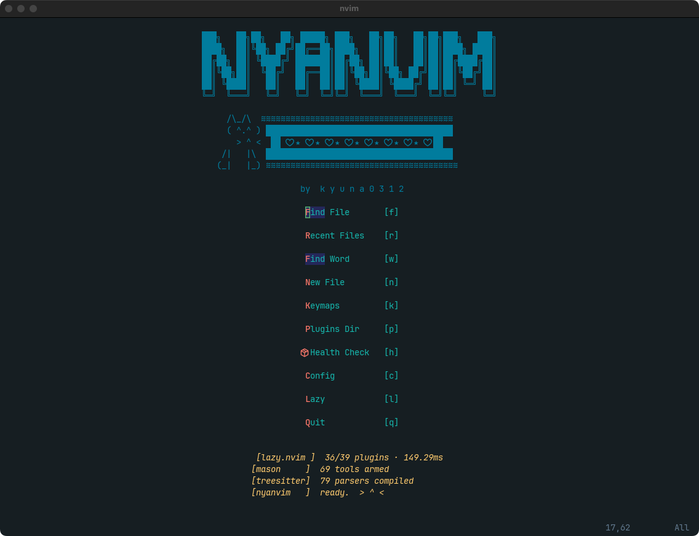
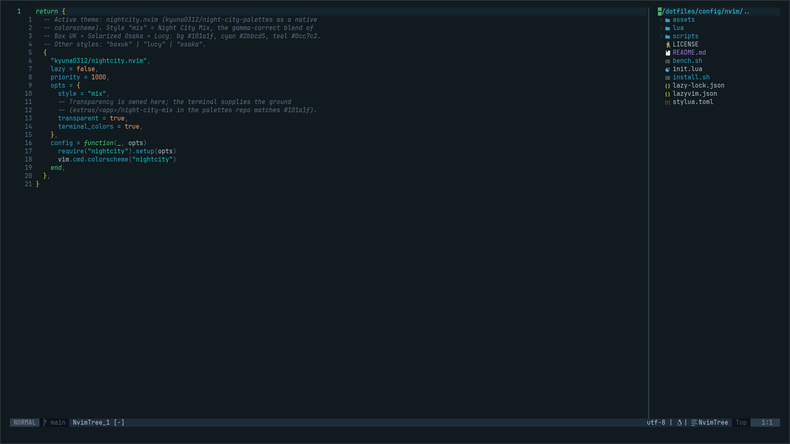
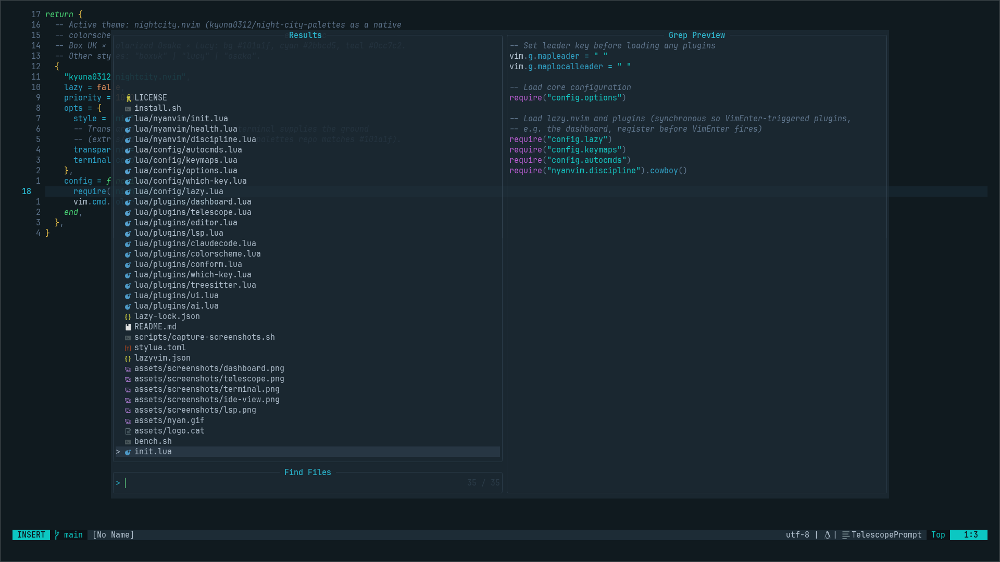
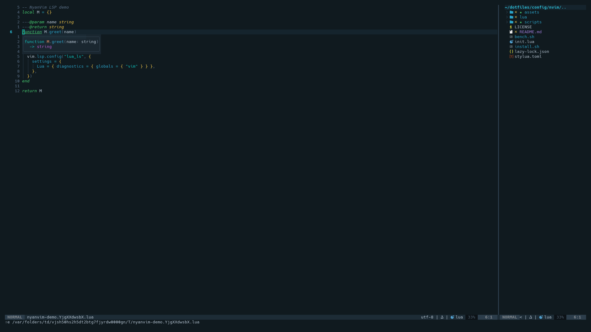
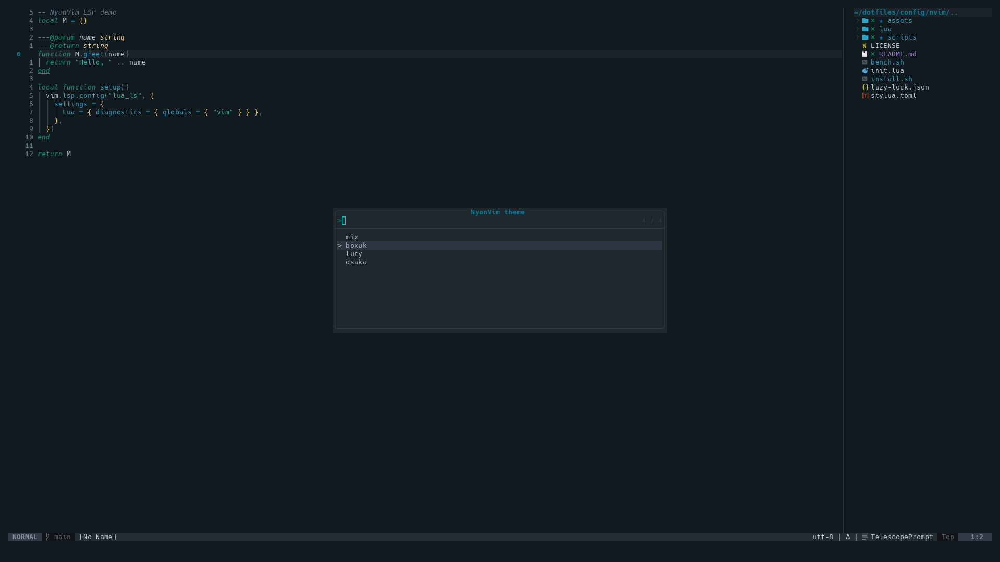
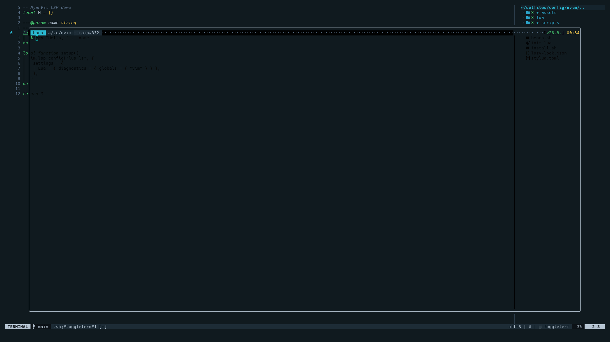

# 🐱 NyanVim

<div align="center">

[](https://neovim.io)
[](https://www.lua.org)
[](docs/perf/)
[](LICENSE)
[](https://github.com/kyuna0312/NyanVim/stargazers)

</div>

**NyanVim** is a ready-to-use Neovim setup: open it and you have an IDE —
file tree, fuzzy finder, LSP, completion, Git, terminal, AI helpers — with a
30ms startup and a theme you can switch live. Made for people who want the
polish of [NvChad](https://github.com/NvChad/NvChad) /
[LunarVim](https://github.com/LunarVim/LunarVim) but in a config small enough
to read in one sitting (~1,200 lines of Lua, one plugin per file).

```console
$ nvim
[lazy.nvim ]  6/41 plugins · 30ms
[mason     ]  69 tools armed
[treesitter]  79 parsers compiled
[nyanvim   ]  ready.  > ^ <
```

<div align="center">
  
</div>

<div align="center">



</div>

## Showcase

| IDE View | Fuzzy Finder |
|----------|-------------|
|  |  |

| LSP Hover | Theme Picker (`<Space>th`) |
|-----------|----------------------------|
|  |  |

| Floating Terminal | |
|-------------------|-|
|  | |

## Quickstart

**Try it without touching your current config** (installs side-by-side as
`~/.config/nyanvim`):

```bash
curl -fsSL https://raw.githubusercontent.com/kyuna0312/NyanVim/main/install.sh | bash -s -- --try
NVIM_APPNAME=nyanvim nvim
```

Like it? Make it your default (your old `~/.config/nvim` is backed up as
`nvim.bak.<timestamp>`):

```bash
curl -fsSL https://raw.githubusercontent.com/kyuna0312/NyanVim/main/install.sh | bash
nvim
```

Plugins install themselves on the first launch (about a minute). Then run
`:NyanHealth` — it tells you if anything is missing.

<details>
<summary>Manual install</summary>

```bash
mv ~/.config/nvim ~/.config/nvim.bak
git clone https://github.com/kyuna0312/NyanVim.git ~/.config/nvim
nvim
```
</details>

## Your first 10 keys

The leader key is **Space**. Press it and wait half a second: which-key lists
every group. These get you through a normal day:

| Key | What it does |
|-----|--------------|
| `Space f f` | find a file by name |
| `Space f g` | search text in the whole project |
| `Ctrl b` | show / hide the file tree |
| `Shift h` / `Shift l` | previous / next open file |
| `g d` · `K` | jump to definition · show docs under the cursor |
| `Space c a` | code action (fix, import, refactor) |
| `Space c f` | format the file |
| `Space g g` | LazyGit (stage, commit, push) |
| `Ctrl \` | floating terminal |
| `Space t h` | theme picker (`j`/`k` preview live, Enter keeps) |

Lost? `Space f k` searches every keymap by description.

## The NyanVim menu — `Space n`

Like LunarVim's `Space L` and Doom's `Space h`: everything about the config
itself lives under one key.

| Key | Command | What it does |
|-----|---------|--------------|
| `Space n u` | `:NyanUpdate` | pull the latest NyanVim and sync plugins |
| `Space n h` | `:NyanHealth` | check Neovim version, tools, compiler |
| `Space n c` | `:NyanConfig` | open **your** overrides file (created on first use) |
| `Space n k` | `:Telescope keymaps` | keymap cheatsheet |
| `Space n l` / `n m` | `:Lazy` / `:Mason` | plugin / LSP-tool managers |
| `Space n t` | | theme picker |

## Make it yours

You never need to edit NyanVim's own files. Your changes live in
`lua/user/`, which is git-ignored, so `:NyanUpdate` can't overwrite them:

- `lua/user/init.lua` — options, keymaps, colorscheme (open with `Space n c`;
  it is created from `lua/user/init.lua.example` the first time)
- `lua/user/plugins/*.lua` — extra plugins as normal
  [lazy.nvim](https://github.com/folke/lazy.nvim) specs, picked up automatically:

```lua
-- lua/user/plugins/surround.lua
return {
  { "kylechui/nvim-surround", event = "VeryLazy", opts = {} },
}
```

Want to change something deeper? Every plugin is one small file in
`lua/plugins/` — copy it into `lua/user/plugins/` with the same plugin name and
your spec merges over the default.

## Update · Uninstall

```bash
# inside Neovim
:NyanUpdate            # git pull + :Lazy sync

# remove NyanVim and restore the backup install.sh made
~/.config/nvim/uninstall.sh          # or:  uninstall.sh --try  for the side-by-side install
```

## Features

- **Lazy everything** — plugins load on `event`/`cmd`/`keys`; only the colorscheme, snacks, treesitter and the dashboard are eager. `:Lazy profile` shows the breakdown.
- **Theme switcher** — `<Space>th` opens a Telescope picker over the four nightcity styles (NvChad-style): `j`/`k` preview live, `⏎` keeps, `Esc` restores; the pick is remembered across restarts.
- **Cheatsheet** — `<Space>fk` fuzzy-searches every keymap with its description; `<Space>` + wait shows the groups (which-key).
- **Try before you switch** — `install.sh --try` installs under `NVIM_APPNAME=nyanvim` next to your own config; `uninstall.sh` restores the backup.
- **Safe to update** — `:NyanUpdate` pulls and syncs; your changes live in git-ignored `lua/user/`.
- **Claude in the editor** — [`coder/claudecode.nvim`](https://github.com/coder/claudecode.nvim): run the Claude Code CLI in a split, send selections/buffers, apply diffs. No API key.
- **opencode** — [`NickvanDyke/opencode.nvim`](https://github.com/NickvanDyke/opencode.nvim): drive the opencode CLI without leaving the editor.
- **Local LLM** — [`David-Kunz/gen.nvim`](https://github.com/David-Kunz/gen.nvim) + [Ollama](https://ollama.com) (`qwen2.5-coder:7b`): offline code chat, no API, no cloud.
- **LSP** — mason + nvim-lspconfig on the modern `vim.lsp.config` API (Neovim 0.11+). 7 servers pre-installed; anything added via `:MasonInstall` is auto-enabled (mason-lspconfig v2). Inline diagnostics on.
- **Single-owner keymaps** — every global map lives in `config/keymaps.lua`; which-key only labels the groups.
- **Completion** — nvim-cmp + LuaSnip + lspkind.
- **Fuzzy finding** — Telescope (fzf-native, ui-select, projects, neoclip).
- **Syntax** — Treesitter (highlight + indent).
- **UI** — NyanVim dashboard, lualine, bufferline, nvim-tree, illuminate, inline colour swatches (colorizer); [snacks.nvim](https://github.com/folke/snacks.nvim) supplies the notification popups, indent guides and floating `vim.ui.input`.
- **Formatting** — conform.nvim: stylua · black · prettier on save, LSP fallback when a formatter is missing (`<Space>cf`).
- **Git** — gitsigns, diffview, lazygit.
- **Editor** — toggleterm, autopairs, Comment.nvim, todo-comments, project.nvim.
- **Keymap discovery** — which-key (v3).
- **Theme** — **Night City Mix** via [nightcity.nvim](https://github.com/kyuna0312/nightcity.nvim): the gamma-correct blend of Box UK Contrast, Solarized Osaka and Cyberpunk Lucy — calm blue-grey grounds with a neon pop, shared across the whole stack.
- **Discipline** — habit-trainer that nags on `hjkl`/arrow spamming.

## Requirements

| Dependency | Version | Notes |
|-----------|---------|-------|
| Neovim | **>= 0.11** | required — Telescope and `vim.lsp.enable` need it. [Install](https://neovim.io) |
| Git | >= 2.19 | |
| Node.js | any LTS | for LSP servers |
| ripgrep | any | `rg` — Telescope grep |
| fd | any | `fd` — Telescope find |
| C compiler | any | `gcc`/`clang` — Treesitter |
| tree-sitter CLI | any | `tree-sitter` — compiles Treesitter parsers (`:TSUpdate`). `cargo install tree-sitter-cli` / `npm i -g tree-sitter-cli` / release binary |
| Nerd Font | any | [nerdfonts.com](https://www.nerdfonts.com/) |
| Claude Code CLI | any | optional — for in-editor Claude (`claude` on PATH) |
| opencode CLI | any | optional — for `<Space>o*` maps (`opencode` on PATH) |
| Ollama | any | optional — for local LLM (`brew install ollama` + `ollama pull qwen2.5-coder:7b`) |

> **Note:** Distro packages are often too old (e.g. Ubuntu ships 0.9.x). Use the
> official AppImage or a recent build to get **0.11+**.

## Key Keymaps

Leader key: **`<Space>`**

### Navigation
| Key | Action |
|-----|--------|
| `<Space>ff` | Find files |
| `<Space>fg` | Live grep |
| `<Space>fb` | Open buffers |
| `<Space>fh` | Help tags |
| `<Space>fk` | Keymaps cheatsheet |
| `<C-b>` | Toggle file explorer (nvim-tree) |
| `<Space>e` | Toggle file explorer |
| `<S-h>` / `<S-l>` | Prev / Next buffer |
| `<C-h/j/k/l>` | Navigate windows |

### LSP
| Key | Action |
|-----|--------|
| `gd` | Go to definition |
| `gD` | Go to declaration |
| `gr` | References |
| `gi` | Implementation |
| `K` | Hover docs |
| `<Space>rn` | Rename symbol |
| `<Space>ca` | Code actions |
| `<Space>cf` | Format buffer |

### AI / Claude
| Key | Action |
|-----|--------|
| `<Space>ac` | Toggle Claude split |
| `<Space>af` | Focus Claude |
| `<Space>as` | Send visual selection (visual mode) |
| `<Space>ab` | Add current buffer to context |
| `<Space>at` | Add file from tree |
| `<Space>aa` / `<Space>ad` | Accept / Deny diff |
| `<Space>ar` / `<Space>aC` | Resume / Continue session |
| `<Space>am` | Select model |
| `<Space>ag` | Local LLM prompt (ollama) |
| `<Space>oa` | Ask opencode |
| `<Space>oo` | opencode menu |

### Git & Tools
| Key | Action |
|-----|--------|
| `<Space>gg` | LazyGit |
| `<Space>gd` | Diffview |
| `<Space>gs` / `gb` / `gc` | Git status / branches / commits |
| `<Space>pp` | Switch project |
| `<Space>th` | Theme picker (live preview) |
| `<Space>tt` | Toggle terminal |
| `<C-\>` | Toggle floating terminal |
| `<Space>cm` / `:Mason` | LSP/tool installer |
| `:Dashboard` | NyanVim dashboard |

Press `<Space>` and wait to browse all groups via which-key.

## Structure

```
init.lua                 -- leader, options, then loads config + discipline
lua/
  config/
    lazy.lua             -- bootstrap + { import = "plugins" }
    options.lua          -- editor options
    keymaps.lua          -- ALL global keymaps (single owner)
    autocmds.lua         -- autocommands
    which-key.lua        -- <leader> group labels only
  plugins/               -- one concern per file, all auto-imported
    colorscheme · ui · dashboard · telescope · lsp · conform
    treesitter · editor · which-key · claudecode · ai
  user/                  -- YOUR overrides (git-ignored): init.lua · plugins/*.lua
  nyanvim/
    init.lua (:Nyan* commands) · health.lua · discipline.lua · theme.lua
```

## Theme — Night City Mix

The colorscheme is [nightcity.nvim](https://github.com/kyuna0312/nightcity.nvim)
(default style `mix`, set in `lua/plugins/colorscheme.lua`) — the blend palette of
[night-city-palettes](https://github.com/kyuna0312/night-city-palettes). Press
`<Space>th` to preview and switch between `mix`, `boxuk`, `lucy` and `osaka`;
the choice is saved to `~/.local/share/nvim/nyanvim-theme`.

The background is transparent (owned by the colorscheme, not an autocmd) —
the terminal supplies the matching `#101a1f` ground.

| Token | Hex | Where |
|-------|-----|-------|
| blue-grey | `#101a1f` | terminal ground behind the transparent bg |
| azure | `#2ba3c9` | functions, properties |
| green | `#49d575` | keywords |
| teal | `#0cc7c2` | strings, cursor line nr, Telescope matching |
| apricot | `#ffa066` | numbers, booleans, constants |
| yellow | `#f2c74b` | types, warnings |
| red | `#f65162` | errors, deleted |
| purple | `#be59d6` | special |
| violet | `#9d7bd8` | todo, hints |

Pairs with the same palette across tmux, Ghostty, kitty, WezTerm, starship and
Übersicht — see [kyuna0312/dotfiles](https://github.com/kyuna0312/dotfiles).

## Languages Included

LSP servers auto-installed via mason: **Lua · Python · TypeScript/JavaScript ·
Rust · JSON · HTML · CSS**. Treesitter additionally parses Go, Bash, Markdown,
Vim, and more.

## FAQ

**Icons look like boxes.** Install a [Nerd Font](https://www.nerdfonts.com/) and
select it in your terminal.

**The background is black, not blue-grey.** NyanVim is transparent; the terminal
supplies the colour. Set your terminal background to `#101a1f` (matching
palettes for Ghostty, kitty, WezTerm, Alacritty and tmux are in
[night-city-palettes](https://github.com/kyuna0312/night-city-palettes)) — or
set `transparent = false` in `lua/user/plugins/colorscheme.lua`.

**Some language has no LSP.** `:Mason`, find the server, press `i`. It is
enabled automatically on the next file you open.

**Something else is off.** `:NyanHealth` first, then `:Lazy` for plugin
errors and `:messages` for the last error text.

## Troubleshoot

```
:NyanHealth
```

## Performance

Startup time is benchmarked on every release using `nvim --startuptime`.

Results live in [`docs/perf/`](docs/perf/) — one file per release, with
mean/median/min/max (written by CI on each tag, or by `./bench.sh` locally).
Latest: [v1.1.0](docs/perf/2026-09-03-v1.1.0.md) — mean 30ms, median 23ms.

Before/after lazy-loading on an M-series Mac (`nvim --startuptime`, 5-run median):

| Scenario | v1.0.0 | v1.1.0 |
|----------|--------|--------|
| dashboard (`nvim`) | ~215ms | ~30ms |
| open a Lua file, LSP attached | ~190ms | ~100ms |

**Run locally:**
```bash
./bench.sh --runs 10
```

Results are saved to `docs/perf/YYYY-MM-DD-VERSION.md`.
